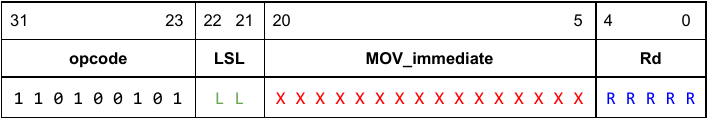

# Laboratorio 1: Arquitectura de Computadoras

## Integrantes
- López, Leandro.
- Mansilla, Kevin Gaston.
- Ramirez, Lautaro

## Ejercicio 1

Para introducir la instruccion MOVZ a la arquitectura ARMv8 con pipeline, que 
tiene la siguiente sintaxis:

```asm
MOVZ <Rd>, <MOV_immediate>, <LSL>
```

Y según el manual de ARMv8, tiene las siguientes características:



Para poder incluirla en nuestro procesador realizamos las siguientes 
modificaciones:

Primero, en el archivo `maindec.sv` agregamos el opcode (Op) de la instrucción 
MOVZ, y además le asignamos los valores necesarios a las señales de control. En 
el caso de *Reg2Loc* le corresponde XX debido a que la instrucción no usa un 
segundo registro, a *ALUSrc* le asignamos 1, ya que necesitamos el valor que 
proviene del signext. *MemtoReg* se pone en 0 porque usamos el valor que 
nos proporciona la ALU, *RegWrite* en 1, ya que escribimos en el registro Rd. 

Por otro lado, *MemRead* y *MemWhite* en 0 debido a que no se lee ni escriben 
memoria. *Branch* es 0 porque no se hace ningún salto en la instrucción y por 
último *ALUOp* en 11, que es el valor que se pasa al aludec para generar la 
señal de alucontrol. 

Luego modificamos `aludec.sv` para que cuando reciba el valor 11 en *ALUOp*,
genere la señal de alucontrol que corresponde a la instrucción MOVZ.

También se tuvo que cambiar el `signext.sv` para que cuando reciba el opcode de 
la instrucción MOVZ, extienda el inmediato más el LSL a 64 bits.

Por último, se modificó el archivo `alu.sv` para que cuando reciba la señal de 
alucontrol que corresponde a la instruccion MOVZ, realice la operación de 
aplicar un logical shift left múltiplo de 16 al inmediato y luego lo escriba 
en el registro Rd.

Esta implementación fue testeada con el siguiente código en assembly:

```
	STUR X1, [X0, #0] // MEM 0:0x1
	STUR X2, [X0, #8] // MEM 1:0x2
	STUR X3, [X16, #0] // MEM 2:0x3
	ADD X3, X4, X5
	add XZR, XZR, XZR
	add XZR, XZR, XZR
	STUR X3, [X0, #24] // MEM 3:0x9
	SUB X3, X4, X5
	add XZR, XZR, XZR
	add XZR, XZR, XZR
	STUR X3, [X0, #32] // MEM 4:0xFFFFFFFFFFFFFFFF
	SUB X4, XZR, X10
	add XZR, XZR, XZR
	add XZR, XZR, XZR	
	STUR X4, [X0, #40] // MEM 5:0xFFFFFFFFFFFFFFF6
	ADD X4, X3, X4
	add XZR, XZR, XZR
	add XZR, XZR, XZR
	STUR X4, [X0, #48] // MEM 6:0xFFFFFFFFFFFFFFF5
	SUB X5, X1, X3
	add XZR, XZR, XZR
	add XZR, XZR, XZR
	STUR X5, [X0, #56] // MEM 7:0x2
	AND X5, X10, XZR
	add XZR, XZR, XZR
	add XZR, XZR, XZR
	STUR X5, [X0, #64] // MEM 8:0x0
	AND X5, X10, X3
	add XZR, XZR, XZR
	add XZR, XZR, XZR
	STUR X5, [X0, #72] // MEM 9:0xA
	AND X20, X20, X20
	STUR X20, [X0, #80] // MEM 10:0x14
	ORR X6, X11, XZR
	add XZR, XZR, XZR
	add XZR, XZR, XZR
	STUR X6, [X0, #88] // MEM 11:0xB
	ORR X6, X11, X3
	add XZR, XZR, XZR
	add XZR, XZR, XZR
	STUR X6, [X0, #96] // MEM 12:0xFFFFFFFFFFFFFFFF
	LDUR X12, [X0, #0]
	add XZR, XZR, XZR
	add XZR, XZR, XZR
	ADD X7, X12, XZR
	add XZR, XZR, XZR
	add XZR, XZR, XZR
	STUR X7, [X0, #104] // MEM 13:0x1
	STUR X12, [X0, #112] // MEM 14:0x1
	ADD XZR, X13, X14
	STUR XZR, [X0, #120] // MEM 15:0x0
	CBZ X0, L1
	add XZR, XZR, XZR
	add XZR, XZR, XZR
	add XZR, XZR, XZR
	STUR X21, [X0, #128] // MEM 16:0x0(si falla CBZ =21)
L1: STUR X21, [X0, #136] // MEM 17:0x15
	ADD X2, XZR, X1
	add XZR, XZR, XZR
	add XZR, XZR, XZR
L2: SUB X2, X2, X1
	ADD X24, XZR, x1
	add XZR, XZR, XZR
	add XZR, XZR, XZR
	STUR X24, [X0, #144] // MEM 18:0x1 y MEM 19=0x1
	ADD X0, X0, X8
	CBZ X2, L2
	add XZR, XZR, XZR
	add XZR, XZR, XZR
	add XZR, XZR, XZR
	STUR X30, [X0, #144] // MEM 20:0x1E
	ADD X30, X30, X30
	add XZR, XZR, XZR
	SUB X21, XZR, X21
	ADD X30, X30, X20
	add XZR, XZR, XZR
	add XZR, XZR, XZR
	LDUR X25, [X30, #-8]
	ADD X30, X30, X30
	add XZR, XZR, XZR
	add XZR, XZR, XZR
	ADD X30, X30, X16
	add XZR, XZR, XZR
	add XZR, XZR, XZR
	STUR X25, [X30, #-8] // MEM 21:0xA (= MEM 9)
	movz x9, 0xf, lsl 0
	add XZR, XZR, XZR
	add XZR, XZR, XZR
	stur x9, [x0, #160] // MEM 22:0xF
	movz x9, 0x2, lsl 16
	add XZR, XZR, XZR
	add XZR, XZR, XZR
	stur x9, [x0, #168] // MEM 23:0x20000
	movz x9, 0x9, lsl 32
	add XZR, XZR, XZR
	add XZR, XZR, XZR
	stur x9, [x0, #176] // MEM 24:0x900000000
	movz x9, 0x8000, lsl 48
	add XZR, XZR, XZR
	add XZR, XZR, XZR
	stur x9, [x0, #184] // MEM 25:0x8000000000000000
finloop: CBZ XZR, finloop
```